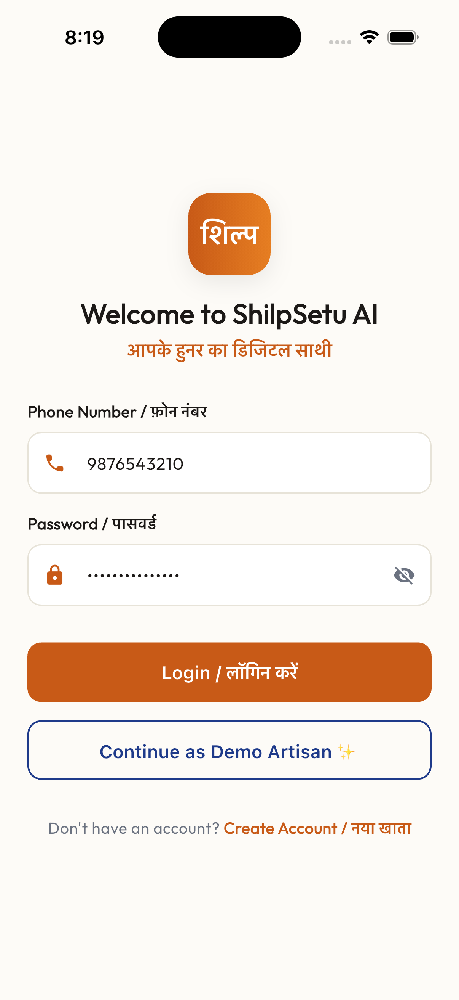
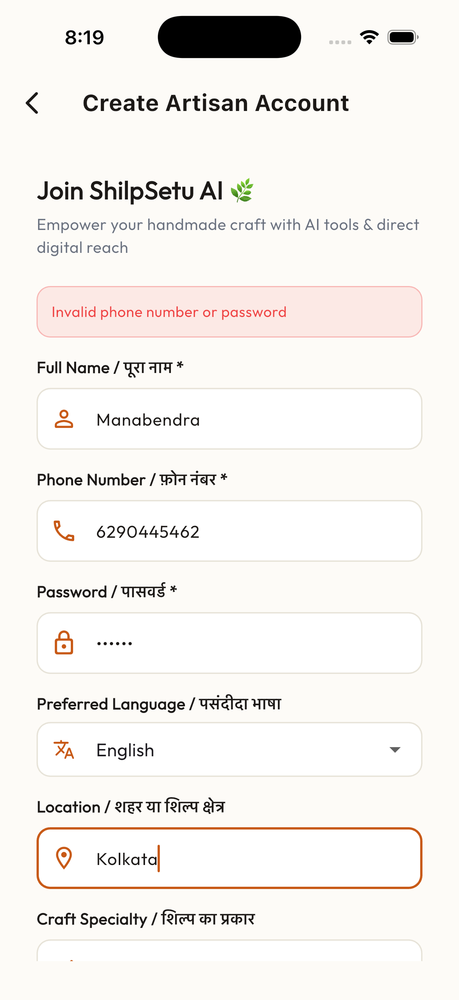
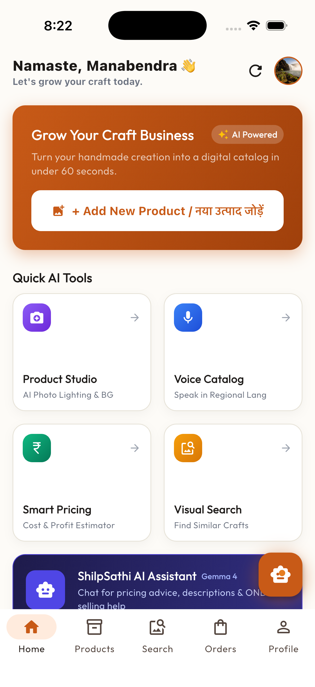
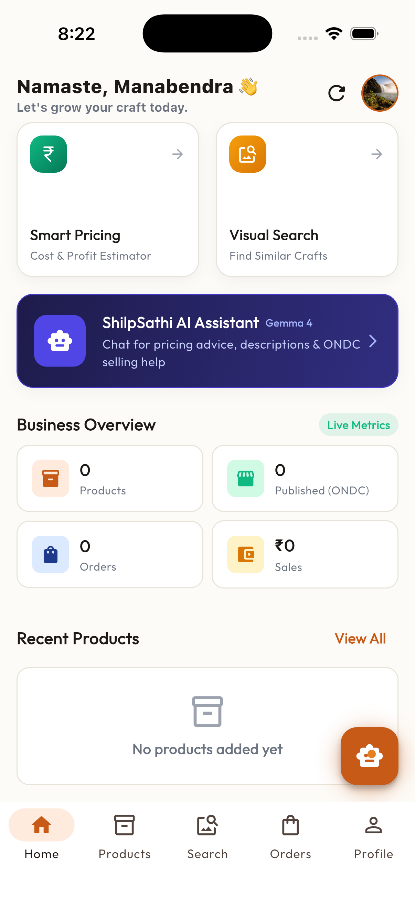
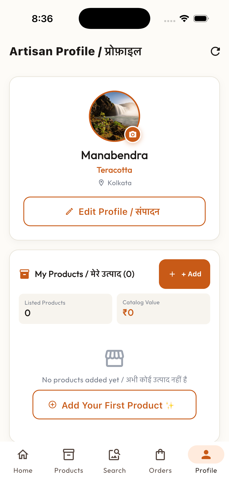
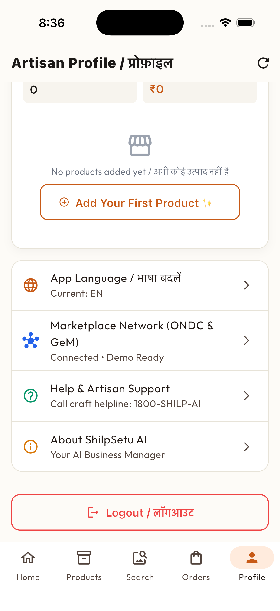
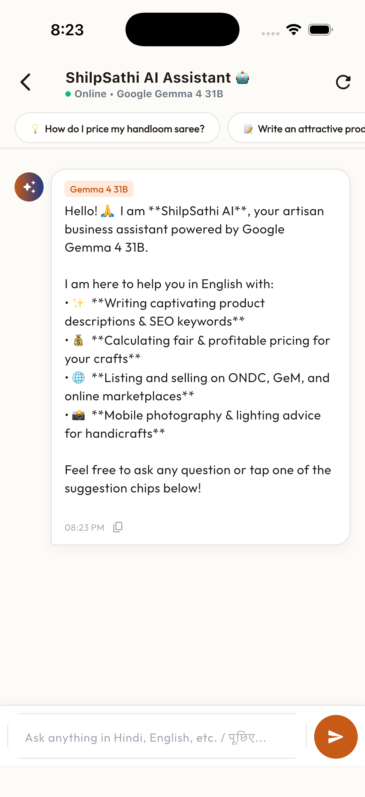
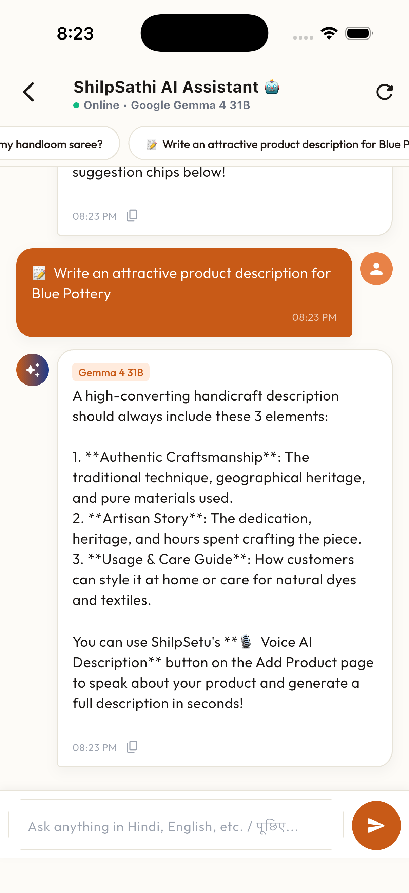
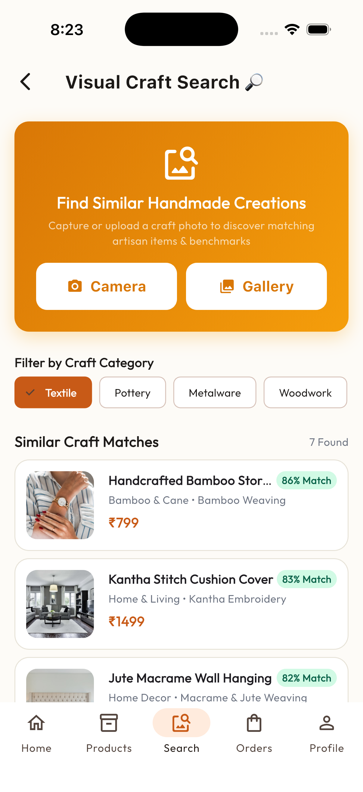

<div align="center">


# ShilpSetu AI

### *Your AI Business Manager for Artisans*
### *आपके हुनर का डिजिटल साथी*

[](https://flutter.dev)
[](https://dart.dev)
[](https://nodejs.org)
[](https://expressjs.com)
[](https://www.mongodb.com)
[](LICENSE)

**Full-stack AI-powered digital business manager for Indian artisans, weavers, and micro-entrepreneurs**

</div>

---

## 🌟 Why ShilpSetu AI?

India has over **7 crore artisans** producing world-class handmade crafts. Yet most remain invisible to digital commerce — struggling with language barriers, poor product photography, and no access to fair pricing data.

**ShilpSetu AI bridges traditional craftsmanship and digital commerce** through voice-first AI tools designed for low-literacy artisans in regional languages.

---

## 🎯 Problem Statement

| Challenge | Impact |
|---|---|
| Limited digital literacy | Cannot list products online |
| Language barriers | Cannot write English descriptions |
| Poor product photography | Products look unprofessional |
| No pricing knowledge | Undervalue their own work |
| Dependence on exhibitions | No year-round market access |
| Complex marketplace onboarding | Cannot navigate ONDC/GeM |

> ShilpSetu AI acts as a **Virtual Business Manager** — handling catalog creation, image enhancement, pricing, and marketplace preparation entirely through voice and camera.

---

## 💡 Our Solution

| Feature | What It Does |
|---|---|
| 📸 **AI Image Studio** | Removes backgrounds, enhances lighting, prepares e-commerce-ready photos |
| 🎙 **Voice Catalog** | Artisan speaks in Hindi/regional language → AI generates professional catalog |
| 🤖 **AI Auto-Catalog** | Extracts product attributes, generates bilingual (Hindi + English) descriptions |
| 💰 **Smart Pricing** | Calculates fair price tiers from material & labor costs + market signals |
| 🔎 **Visual Search** | Finds similar products using photos for market comparison |
| 📦 **Product Management** | Full CRUD — create, edit, publish, archive products |
| 🛒 **Order Management** | Track order lifecycle from pending to delivered |
| 🌐 **Marketplace Simulation** | Demonstrates ONDC and GeM listing workflows |
| 🗣 **6-Language UI** | Hindi, English, Bengali, Tamil, Telugu, Marathi |

---

## ✨ Key Features

### 📸 AI Product Image Studio
- **Studio-quality background removal** (RMBG-2.0 via HuggingFace)
- Automatic lighting normalization and color enhancement
- E-commerce crop and centering
- Before/After comparison slider + Quality Score (0–100)

### 🎙 Multilingual Voice Catalog
- Speak in Hindi, Bengali, Tamil, Telugu, Marathi, or English
- Automatic language detection and translation
- Extracts: craft technique, material, color, dimensions, category
- Generates simultaneous English + Hindi catalog entries with SEO keywords

### 💰 Smart Pricing Engine
- 4-tier price recommendation: Minimum · Competitive · Recommended ★ · Premium
- Transparent profit margin and estimated earnings calculation
- Market trend signals with human-readable explanations

### 🌐 Simulated Marketplace Publishing
- Animated 4-step publishing workflow (Prepare → Validate → Create → Success)
- Generates unique Demo Listing IDs (e.g., `ONDC-DEMO-829341`, `GEM-DEMO-572941`)
- Real-time marketplace dashboard with listing status

---

## 📱 Application Screens

### 🔐 Authentication
| Screen | File |
|---|---|
| Splash Screen | `splash/splash_screen.dart` |
| Onboarding | `onboarding/onboarding_screen.dart` |
| Login | `auth/login_screen.dart` |
| Register | `auth/register_screen.dart` |

### 🏠 Dashboard
| Screen | File |
|---|---|
| Home Dashboard | `home/home_screen.dart` |
| Product List | `products/product_list_screen.dart` |

### 📦 Product Creation Flow
| Screen | File |
|---|---|
| Add Product Hub | `products/add_product_hub_screen.dart` |
| Product Form | `products/product_form_screen.dart` |
| AI Image Studio | `image_studio/image_studio_screen.dart` |
| Voice Catalog | `catalog/voice_catalog_screen.dart` |
| AI Catalog Result | `catalog/catalog_result_screen.dart` |
| Smart Pricing | `pricing/smart_pricing_screen.dart` |
| Product Preview | `products/product_preview_screen.dart` |
| Product Detail | `products/product_detail_screen.dart` |

### 🛒 Commerce
| Screen | File |
|---|---|
| Orders | `orders/orders_screen.dart` |
| Order Detail | `orders/order_detail_screen.dart` |
| Marketplace Dashboard | `marketplace/marketplace_dashboard_screen.dart` |
| Marketplace Publish | `marketplace/marketplace_publish_screen.dart` |

### 🔍 Search & Discovery
| Screen | File |
|---|---|
| Visual Search | `search/visual_search_screen.dart` |

### 👤 Profile & Support
| Screen | File |
|---|---|
| Profile | `profile/profile_screen.dart` |
| AI Chatbot | `chatbot/chatbot_screen.dart` |

```
Total Screens: 21
```

---

## 🔄 Application Flow

```
Splash → Onboarding → Login / Demo Login
              ↓
        Home Dashboard
              ↓
        Add Product Hub
              ↓
     Camera / Gallery Upload
              ↓
        AI Image Studio
              ↓
       Product Form (details)
              ↓
      Voice Description Input
              ↓
        AI Catalog Result
              ↓
        Smart Pricing
              ↓
       Product Preview
              ↓
           Publish
              ↓
   Marketplace Dashboard
              ↓
    Visual Search / Orders
              ↓
        Profile / Chatbot
```

---

## 🏗️ System Architecture

```
                 ┌─────────────────────────────┐
                 │        Flutter App           │
                 │  UI → Riverpod → Repository  │
                 │  Dio HTTP Client + JWT        │
                 └────────────┬─────────────────┘
                              │ REST API
                              ▼
                 ┌─────────────────────────────┐
                 │    Node.js + Express.js      │
                 │  Routes → Controllers        │
                 │  Middleware → Services       │
                 │  Helmet · CORS · Rate Limit  │
                 └────────────┬─────────────────┘
                              │
              ┌───────────────┼────────────────┐
              │               │                │
              ▼               ▼                ▼
        ┌──────────┐   ┌─────────────┐  ┌───────────────┐
        │ MongoDB  │   │  AI Layer   │  │  Marketplace  │
        │ Mongoose │   │  (Modular)  │  │  Simulation   │
        └──────────┘   └─────────────┘  └───────────────┘
                              │
                   ┌──────────┼──────────┐
                   ▼          ▼          ▼
                Catalog    Pricing   Image
                Service    Service   Service
```

---

## 🤖 AI Architecture

### Voice → Catalog
```
Voice Input → Language Detection → Translation
    → NLP Extraction → Catalog Generation
    → English + Hindi Output + SEO Keywords
```

### Pricing Engine
```
Material Cost + Labor Cost + Other Cost
    → Market Benchmark Analysis
    → 4-Tier Price Recommendation
    → Profit Margin + Market Trend
```

### Image Studio
```
Product Photo → Background Removal (RMBG-2.0)
    → Lighting Enhancement → Color Correction
    → E-commerce Crop → Quality Score
```

> All AI services use a **modular, swappable architecture**. Built-in simulation services work offline and can be replaced with real providers (Gemini, OpenAI, HuggingFace) without changing the rest of the application.

---

## 🛠️ Technology Stack

| Layer | Technology |
|---|---|
| Mobile / Web | Flutter 3.22 |
| Language | Dart 3.x |
| Backend | Node.js 18+ |
| API Framework | Express.js 4.x |
| Database | MongoDB |
| ODM | Mongoose |
| Authentication | JWT (jsonwebtoken) |
| Password Security | bcryptjs |
| Networking (client) | Dio 5.x |
| State Management | flutter_riverpod 2.x |
| Navigation | go_router 14.x |
| Image Processing | Sharp, image_picker |
| Image Caching | cached_network_image |
| File Upload | Multer |
| Charts | fl_chart |
| Animations | animate_do |
| Security | Helmet, CORS, express-rate-limit |
| Validation | Joi |
| Localization | flutter_localizations + intl |
| Version Control | Git + GitHub |

---

## 📂 Project Structure

```
shilpsetu-ai/
│
├── frontend/                    — Flutter application
│   ├── lib/
│   │   ├── app/                 — App root, theme, router
│   │   ├── core/                — Network, storage, services, widgets
│   │   ├── features/            — Screen + provider + repository modules
│   │   │   ├── auth/
│   │   │   ├── home/
│   │   │   ├── products/
│   │   │   ├── catalog/
│   │   │   ├── image_studio/
│   │   │   ├── pricing/
│   │   │   ├── orders/
│   │   │   ├── marketplace/
│   │   │   ├── search/
│   │   │   ├── chatbot/
│   │   │   ├── profile/
│   │   │   ├── onboarding/
│   │   │   └── splash/
│   │   └── shared/models/       — Shared data models
│   ├── assets/icons/
│   ├── test/
│   └── pubspec.yaml
│
├── backend/                     — Node.js + Express.js API
│   ├── src/
│   │   ├── config/              — DB and env configuration
│   │   ├── controllers/         — Route handlers
│   │   ├── models/              — Mongoose schemas
│   │   ├── routes/              — Express routers
│   │   ├── services/            — AI, pricing, marketplace, search
│   │   │   ├── ai/
│   │   │   ├── pricing/
│   │   │   ├── marketplace/
│   │   │   └── search/
│   │   ├── middleware/          — Auth, upload, rate limit, errors
│   │   ├── validators/          — Joi validation schemas
│   │   ├── utils/               — Token, response, logger helpers
│   │   └── scripts/             — Seed and test scripts
│   ├── uploads/                 — Uploaded product images
│   ├── .env.example
│   └── package.json
│
├── docs/                        — Documentation
│   ├── architecture.md
│   ├── api.md
│   ├── ai-architecture.md
│   └── screenshots/
│
├── .github/
│   ├── workflows/flutter.yml    — CI pipeline
│   ├── ISSUE_TEMPLATE/
│   └── pull_request_template.md
│
├── .gitignore
├── LICENSE
├── SECURITY.md
├── CODE_OF_CONDUCT.md
└── README.md
```

---

## 🔌 API Overview

```
Authentication
  POST   /api/auth/register          — Register new artisan
  POST   /api/auth/login             — Login with phone + password
  POST   /api/auth/demo-artisan      — One-tap demo login
  GET    /api/auth/me                — Get current user profile
  PUT    /api/auth/profile           — Update profile

Products
  GET    /api/products               — List artisan products
  POST   /api/products               — Create product
  GET    /api/products/stats/summary — Dashboard analytics
  GET    /api/products/:id           — Get product
  PUT    /api/products/:id           — Update product
  DELETE /api/products/:id           — Delete product

AI Services
  POST   /api/ai/image-enhance       — Image studio processing
  POST   /api/ai/catalog             — Voice/text → AI catalog
  POST   /api/ai/pricing             — Smart pricing calculation
  POST   /api/ai/voice               — Voice text processing

Orders
  GET    /api/orders                 — List orders
  GET    /api/orders/:id             — Order details
  POST   /api/orders                 — Create order
  PATCH  /api/orders/:id/status      — Update order status

Search
  POST   /api/search/visual          — Visual similarity search

Marketplace
  POST   /api/marketplace/publish    — Publish to ONDC + GeM
  GET    /api/marketplace/listings   — Get marketplace listings
```

Full API documentation: [`docs/api.md`](docs/api.md)

---

## 📸 Screenshots

<div align="center">

| Splash & Onboarding | Home Dashboard | Product List |
|---|---|---|
|  |  |  |

| AI Image Studio | Voice Catalog | Smart Pricing |
|---|---|---|
|  |  |  |

| Marketplace | Orders | Profile |
|---|---|---|
|  |  |  |

</div>

> See [`docs/screenshots/`](docs/screenshots/) for all 24 screenshots.

---

## 🚀 Demo Flow

```
1.  Tap "Continue as Demo Artisan" on login screen
2.  View Home Dashboard with analytics
3.  Tap "Add Product" → capture / upload product photo
4.  AI Image Studio enhances the photo automatically
5.  Fill product details → tap "Voice Describe"
6.  Speak in Hindi or regional language
7.  AI generates professional English + Hindi catalog
8.  Smart Pricing calculates 4-tier price recommendations
9.  Preview product → tap "Publish"
10. Marketplace dashboard shows ONDC and GeM listings
11. Visual Search to find similar products
12. Orders dashboard shows order lifecycle management
```

---

## 🛠️ Installation

### Prerequisites

| Tool | Version |
|---|---|
| Node.js | 18 or higher |
| MongoDB | 6+ (running locally) |
| Flutter SDK | 3.22 or higher |
| Git | Any recent version |

---

### Backend Setup

```bash
cd backend

# Install dependencies
npm install

# Create and configure environment
cp .env.example .env
# Edit .env — set MONGO_URI, JWT_SECRET, PORT

# Seed the database with demo artisan data
npm run seed

# Start development server
npm run dev
```

**Backend API:** `http://localhost:8000/api`  
**Health Check:** `http://localhost:8000/api/health`

---

### Frontend Setup

```bash
cd frontend

# Install Flutter dependencies
flutter pub get

# Run the app (choose your target)
flutter run                  # Default device
flutter run -d chrome        # Flutter Web
flutter run -d emulator-...  # Android emulator
```

---

## ⚙️ Environment Variables

### Backend (`backend/.env`)

| Variable | Description | Default |
|---|---|---|
| `PORT` | Server port | `8000` |
| `NODE_ENV` | Environment | `development` |
| `MONGO_URI` | MongoDB connection string | — |
| `JWT_SECRET` | JWT signing key (min 32 chars) | — |
| `JWT_EXPIRES_IN` | Token expiry | `7d` |
| `CLIENT_URL` | Allowed CORS origin | `*` |
| `MAX_FILE_SIZE` | Upload limit in bytes | `10485760` |
| `AI_PROVIDER` | AI backend (`mock` or real) | `mock` |

---

## 📡 API Host Configuration

The Flutter app automatically selects the correct API host:

| Platform | Host Used |
|---|---|
| Flutter Web | `http://127.0.0.1:8000` |
| Android Emulator | `http://10.0.2.2:8000` |
| iOS Simulator / Desktop | `http://127.0.0.1:8000` |
| Physical Device | Set your machine's local IP in `api_constants.dart` |

---

## 🧪 Testing

### Flutter

```bash
cd frontend
flutter analyze          # Static analysis
flutter test             # Unit + widget tests
```

### Backend

```bash
cd backend
npm test                 # Endpoint verification script
```

---

## 🔐 Security

- JWT tokens stored securely using `flutter_secure_storage`
- All passwords hashed with `bcryptjs`
- API rate limiting via `express-rate-limit`
- Security headers via `Helmet`
- Input validation via `Joi`
- CORS configured with explicit origin allowlist

See [`SECURITY.md`](SECURITY.md) for the full security policy and best practices.

---

## 🌐 Marketplace Integration

> ⚠️ **Important Disclaimer**
>
> ONDC and GeM functionality in this prototype is **simulated for demonstration purposes**. The application generates realistic listing IDs and workflows but does **not** create real marketplace listings, transactions, or buyer-seller connections.
>
> The architecture is designed to be extended with real Beckn Protocol / GeM API integration.

---

## 👥 Contributors

### Team ShilpSetu AI

| Contributor | GitHub |
|---|---|
| Shrelekha Das | [@shrelekhadas9-cell](https://github.com/shrelekhadas9-cell) |
| Piyali Debnath | [@piyali370](https://github.com/piyali370) |
| Sovangi Poddar | [@Sleeping-Simi](https://github.com/Sleeping-Simi) |
| Aditya Naskar | [@Aditya-Timekillerr](https://github.com/Aditya-Timekillerr) |
| Sumit Pal | [@InnovativeSumit](https://github.com/InnovativeSumit) |
| Manabendra Mondal | [@manab-ghh](https://github.com/manab-ghh) |

**Total Contributors: 6**

---

## 🤝 Contributing

```bash
# Fork the repository on GitHub (or clone directly)
git clone https://github.com/manab-ghh/SIH-2026.git

# Create a feature branch
git checkout -b feature/your-feature-name

# Make your changes
# Run flutter analyze and flutter test

# Commit with a clear message
git commit -m "feat: add voice input for Bengali language"

# Push and open a Pull Request
git push origin feature/your-feature-name
```

Please read [`CODE_OF_CONDUCT.md`](CODE_OF_CONDUCT.md) before contributing.  
Issue templates and PR template are in [`.github/`](.github/).

---

## 📜 License

This project is licensed under the **MIT License** — see [`LICENSE`](LICENSE) for details.

---

## ❤️ Built For

<div align="center">

**Smart India Hackathon 2026**

*Empowering India's 7 crore artisans with AI-driven digital commerce tools*

*"Connecting Traditional Craftsmanship to Digital India"*

</div>
